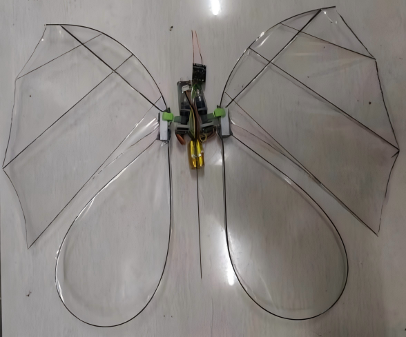
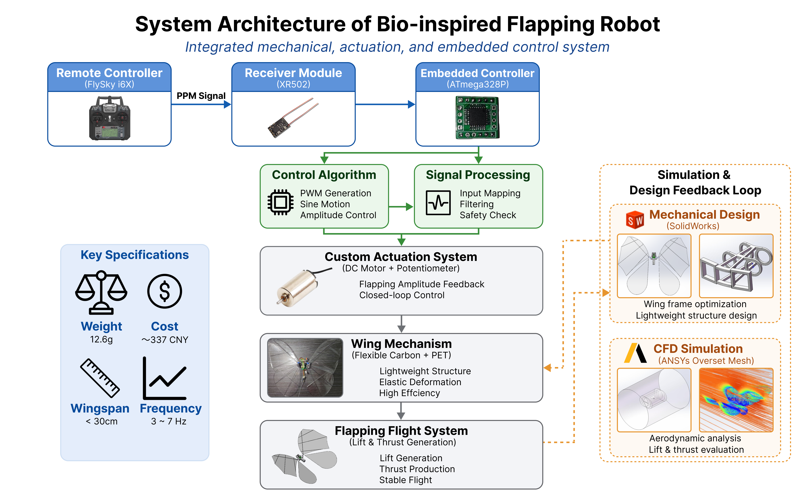
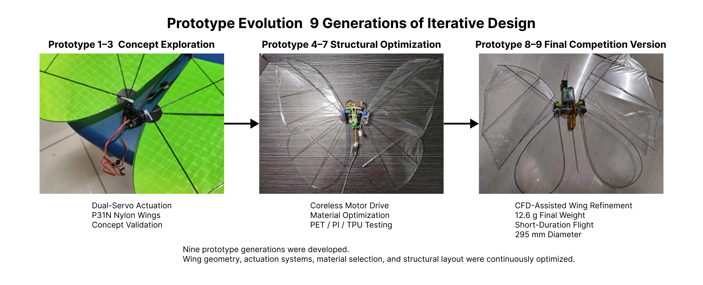
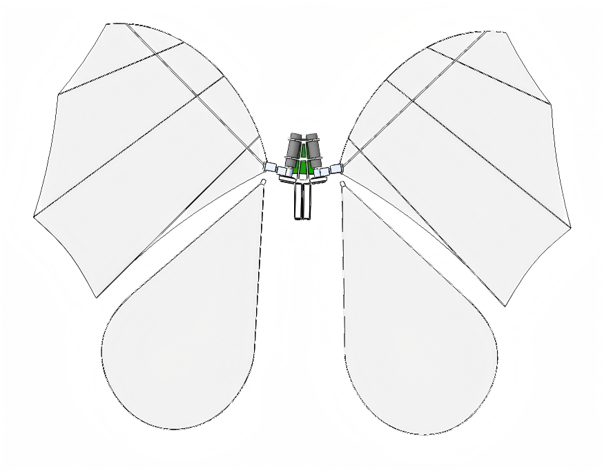
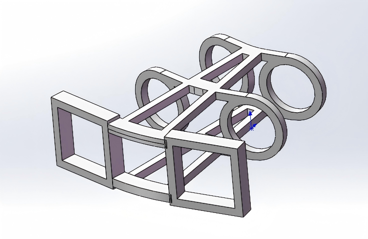
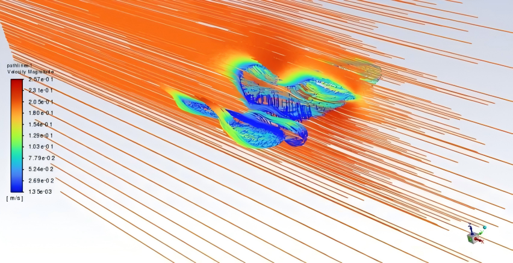
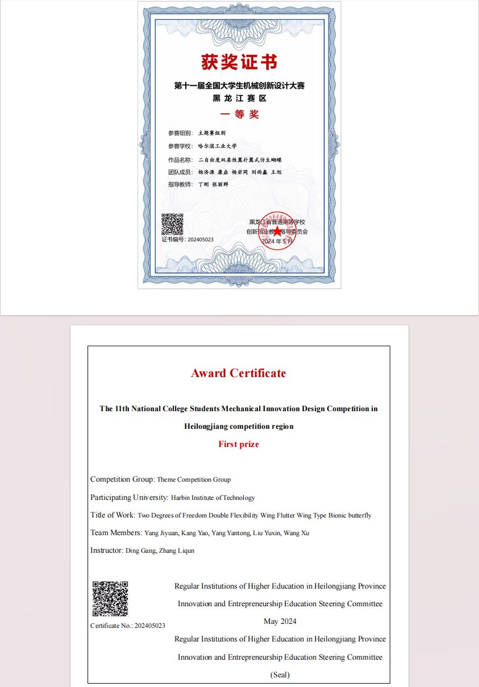

# Bio-Inspired Butterfly Robot

A lightweight bio-inspired flapping-wing robot developed for the National College Students Mechanical Innovation Design Competition in China.

<p align="center">
  
</p>

---

## Project Overview

This project focuses on the design and development of a butterfly-inspired flapping-wing robotic system.

The objective was to investigate lightweight flapping-wing mechanisms capable of generating lift and thrust while maintaining a compact and low-cost structure.

Over the course of the project, nine prototype generations were developed and tested. The final design achieved a total weight of **12.6 g** with a body diameter of approximately **29.5 cm**, demonstrating short-duration flight capability.

---

## Key Specifications

| Parameter | Value |
|------------|------------|
| Robot Type | Bio-inspired Flapping-Wing Robot |
| Total Weight | 12.6 g |
| Body Diameter | 29.5 cm |
| Actuation | Dual 610 Coreless Motors |
| Structure Material | Lightweight Resin Frame |
| Wing Spar Material | Carbon Fiber Rods |
| Wing Membrane | PET Film |
| Development Iterations | 9 Generations |
| Competition Result | Provincial First Prize |

---

## System Architecture

<p align="center">
  
</p>

The robot consists of:

- FlySky i6X remote controller
- RX502 receiver module
- ATmega328P embedded controller
- Custom motor actuation system
- Lightweight flapping-wing mechanism

The control system converts PPM signals from the remote controller into motor commands to regulate wing flapping behavior.

---

## Design Evolution

<p align="center">
  
</p>

### Prototype 1–3: Concept Validation

- Dual-servo actuation
- P31N nylon wing membrane
- Initial mechanism verification
- Structural feasibility testing

### Prototype 4–7: Structural Optimization

- Transition to dual 610 coreless motors
- Weight reduction
- PET / TPU / PI material testing
- Wing geometry refinement

### Prototype 8–9: Final Competition Version

- CFD-assisted wing optimization
- Final material selection
- Total weight reduced to 12.6 g
- Achieved short-duration flight

---

## CAD Design

### Overall CAD Model

<p align="center">
  
</p>

The wing geometry was inspired by butterfly morphology and optimized through multiple design iterations.

### Lightweight Body Frame

<p align="center">
  
</p>

A custom lightweight frame was designed in SolidWorks and manufactured using resin 3D printing technology.

Design goals:

- Low structural mass
- Adequate stiffness
- Easy assembly
- Compatibility with miniature actuators

---

## Material Selection

Several membrane materials were experimentally evaluated.

| Material | Surface Density (g/m²) | Cost (RMB/m²) | Result |
|------------|------------|------------|------------|
| P31N Nylon | 36 | 25 | Early Prototype |
| TPU Film | 14.4 | 11 | Tested |
| PI Film | 7.1 | 806 | Rejected |
| PET Film (0.005 mm) | 6.9 | 3.1 | Final Choice |

Selection criteria:

- Low weight
- Sufficient flexibility
- Low cost
- Good manufacturability

PET film provided the best balance between weight, flexibility, and cost.

---

## Motor Selection

The actuation system underwent multiple iterations.

| Motor Type | Weight (g) | Torque | Result |
|------------|------------|------------|------------|
| DS1906B Servo | 9.2 | 2.6 kg·cm | Too Heavy |
| 610 Coreless Motor | 1.12 | 0.12 kg·cm | Selected |

The switch from servo-based actuation to lightweight coreless motors significantly reduced total system mass.

---

## CFD-Assisted Wing Refinement

<p align="center">
  
</p>

Basic CFD simulations were used to visualize airflow behavior around the wing structure.

The simulations helped identify flow disturbances and supported wing geometry refinement during later design stages.

CFD results were used as an auxiliary design tool rather than a primary optimization method.

---

## Final Prototype

<p align="center">
  
</p>

Final prototype characteristics:

- 12.6 g total mass
- Carbon fiber wing structure
- PET membrane wings
- Dual motor actuation
- Lightweight resin frame
- Remote-controlled flapping motion

---

## Competition Achievement

<p align="center">
  
</p>

This project received a **Provincial First Prize** in the National College Students Mechanical Innovation Design Competition.

---

## My Contributions

- Mechanical architecture design
- Wing mechanism design
- CAD modeling (SolidWorks)
- Prototype fabrication and assembly
- Material evaluation and selection
- Motor selection and lightweight optimization
- CFD-assisted design iteration
- Experimental testing and validation
- Competition presentation preparation

---

## Tools & Technologies

### Mechanical Design

- SolidWorks
- 3D Printing
- Carbon Fiber Fabrication

### Simulation

- ANSYS CFD
- Structural Analysis

### Electronics

- ATmega328P
- FlySky i6X
- RX502 Receiver
- Coreless DC Motors

### Manufacturing

- Resin 3D Printing
- Rapid Prototyping
- Lightweight Structure Design

---

## Repository Structure

```text
Bio-Inspired-Butterfly-Robot
│
├── images/
│   ├── award_certificate.png
│   ├── body_frame_design.png
│   ├── cad_overview.png
│   ├── cfd_wing_refinement.png
│   ├── final_prototype.png
│   ├── prototype_evolution.png
│   └── system_architecture.png
│
├── LICENSE
└── README.md
```

---

## Disclaimer

This repository is intended for portfolio and educational purposes.

Detailed CAD models, manufacturing files, and competition documentation are not publicly released.
